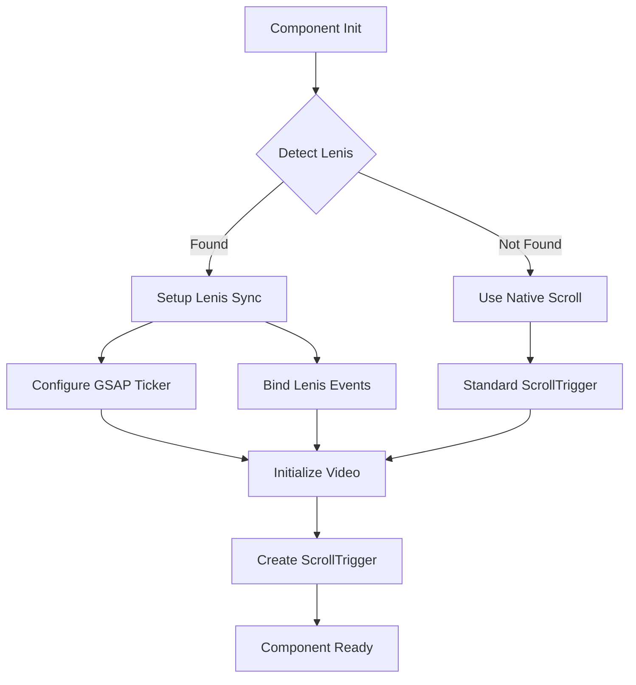

# Design Document: Lenis-GSAP Synchronization for VideoScrollSection

## Overview

This design document outlines the solution for integrating Lenis smooth scroll library with the VideoScrollSection component's GSAP ScrollTrigger functionality. The core issue is that Lenis modifies the native scroll behavior, which can cause ScrollTrigger to receive inaccurate scroll position data. The solution involves detecting Lenis presence and synchronizing its animation frame updates with GSAP's ticker system.

The design maintains backward compatibility by gracefully handling both scenarios: pages with Lenis and pages without Lenis. The component will automatically detect the environment and configure itself accordingly.

## Architecture

### Component Structure

The VideoScrollSection component will maintain its current structure with the following enhancements:

```
VideoScrollSection.astro
├── Props Interface (unchanged)
├── HTML Structure (unchanged)
├── Script Section (modified)
│   ├── Lenis Detection Module (new)
│   ├── Lenis-GSAP Sync Module (new)
│   ├── Video Initialization Module (unchanged)
│   └── ScrollTrigger Setup Module (unchanged)
└── Styles (unchanged)
```

### Integration Flow



## Components and Interfaces

### 1. Lenis Detection Module

**Purpose**: Detect if Lenis is available in the global scope

**Interface**:
```typescript
function detectLenis(): Lenis | null {
  // Returns Lenis instance or null
}
```

**Implementation Details**:
- Check for `window.lenis` global variable
- Validate that the object has required methods (`on`, `raf`)
- Log detection result for debugging
- Return null if not found or invalid

### 2. Lenis-GSAP Synchronization Module

**Purpose**: Synchronize Lenis scroll events with GSAP ScrollTrigger

**Interface**:
```typescript
function setupLenisSync(lenis: Lenis): void {
  // Configure synchronization
}
```

**Implementation Details**:

According to [Lenis documentation and community best practices](https://gsap.com/community/forums/topic/38517-scrolltrigger-and-lenis/), the synchronization requires three steps:

1. **Bind Lenis scroll events to ScrollTrigger**:
   ```javascript
   lenis.on('scroll', ScrollTrigger.update);
   ```
   This ensures ScrollTrigger recalculates positions when Lenis updates scroll.

2. **Add Lenis RAF to GSAP ticker**:
   ```javascript
   gsap.ticker.add((time) => {
     lenis.raf(time * 1000);
   });
   ```
   This integrates Lenis animation frame into GSAP's ticker system. Note: time is in seconds, Lenis expects milliseconds.

3. **Disable GSAP lag smoothing**:
   ```javascript
   gsap.ticker.lagSmoothing(0);
   ```
   This prevents GSAP from trying to compensate for frame drops, which can conflict with Lenis.

### 3. Video Initialization Module (Unchanged)

**Purpose**: Load and prepare video for scrubbing

**Current Implementation**:
- Force video load
- Wait for metadata
- Test playback capability
- Reset to start position

This module remains unchanged as it works correctly in both scenarios.

### 4. ScrollTrigger Setup Module (Unchanged)

**Purpose**: Create and configure ScrollTrigger instance

**Current Implementation**:
- Calculate scroll distance based on viewport height
- Configure pin behavior
- Set up scrub mode
- Bind progress updates to video currentTime
- Handle enter/leave callbacks

This module remains unchanged as the synchronization happens at a lower level.

## Data Models

### Lenis Instance Type

```typescript
interface Lenis {
  on(event: string, callback: Function): void;
  off(event: string, callback: Function): void;
  raf(time: number): void;
  start(): void;
  stop(): void;
  scrollTo(target: any, options?: any): void;
}
```

### Component State

```typescript
interface ComponentState {
  lenisInstance: Lenis | null;
  videoElement: HTMLVideoElement | null;
  scrollTriggerInstance: ScrollTrigger | null;
  isInitialized: boolean;
  videoDuration: number;
}
```

## Correctness Properties

*A property is a characteristic or behavior that should hold true across all valid executions of a system—essentially, a formal statement about what the system should do. Properties serve as the bridge between human-readable specifications and machine-verifiable correctness guarantees.*

### Acceptance Criteria Testing Prework

1.1 WHEN VideoScrollSection 组件初始化时，THE Component SHALL 检测全局 window.lenis 实例是否存在
  Thoughts: This is about detecting the presence of Lenis. We can test this by creating scenarios with and without Lenis and verifying the detection result matches the actual state.
  Testable: yes - property

1.2 WHEN Lenis 实例存在时，THE Component SHALL 将 Lenis 的滚动事件与 ScrollTrigger 同步
  Thoughts: This is about ensuring the sync function is called when Lenis exists. We can verify that the event listener is registered.
  Testable: yes - property

1.3 WHEN Lenis 实例存在时，THE Component SHALL 将 Lenis 的 raf 方法添加到 GSAP 的 ticker 中
  Thoughts: This is about verifying the ticker integration. We can check that gsap.ticker has the Lenis raf callback.
  Testable: yes - property

1.4 WHEN Lenis 实例存在时，THE Component SHALL 禁用 GSAP 的延迟平滑（lagSmoothing）
  Thoughts: This is a configuration check. We can verify that lagSmoothing is set to 0 when Lenis is present.
  Testable: yes - example

1.5 WHEN Lenis 实例不存在时，THE Component SHALL 使用原生滚动行为正常工作
  Thoughts: This is about backward compatibility. We can test that the component initializes and works without Lenis.
  Testable: yes - property

2.1 WHEN VideoScrollSection 在不使用 Lenis 的页面中使用时，THE Component SHALL 正常初始化并工作
  Thoughts: This is the same as 1.5, testing backward compatibility.
  Testable: yes - property

2.2 WHEN 页面不包含 Lenis 时，THE Component SHALL 使用原生浏览器滚动
  Thoughts: This is verifying the fallback behavior, same as above.
  Testable: yes - property

2.3 WHEN 组件在 pure-test.astro 页面中使用时，THE Component SHALL 保持当前的工作状态
  Thoughts: This is an integration test for a specific page. This is an example test case.
  Testable: yes - example

2.4 WHEN Lenis 检测失败或未定义时，THE Component SHALL 不抛出错误并继续执行
  Thoughts: This is about error handling. We can test that no exceptions are thrown when Lenis is undefined.
  Testable: yes - property

3.1 WHEN 用户滚动到视频区域时，THE Component SHALL 固定视频容器在视口中
  Thoughts: This is existing functionality that should be preserved. We can verify the pin behavior works.
  Testable: yes - property

3.2 WHEN 用户滚动时，THE Component SHALL 根据滚动进度更新视频播放时间
  Thoughts: This is the core video scrubbing functionality. We can verify video.currentTime matches scroll progress.
  Testable: yes - property

3.3 WHEN 用户向下滚动时，THE Component SHALL 正向播放视频
  Thoughts: This is about the direction of video playback. We can verify currentTime increases with scroll.
  Testable: yes - property

3.4 WHEN 用户向上滚动时，THE Component SHALL 逆向播放视频
  Thoughts: This is about reverse playback. We can verify currentTime decreases with reverse scroll.
  Testable: yes - property

3.5 WHEN 用户离开视频区域时，THE Component SHALL 取消固定并恢复正常滚动
  Thoughts: This is about the unpin behavior. We can verify the pin is released when leaving the trigger area.
  Testable: yes - property

4.1 THE Component SHALL 接受 scrollDistance 参数来控制滚动距离
  Thoughts: This is about parameter acceptance. We can verify the parameter is used in calculations.
  Testable: yes - example

4.2 THE Component SHALL 接受 scrubSpeed 参数来控制响应速度
  Thoughts: This is about parameter acceptance. We can verify the parameter is passed to ScrollTrigger.
  Testable: yes - example

4.3 THE Component SHALL 接受 showDebug 参数来控制调试信息显示
  Thoughts: This is about conditional rendering. We can verify debug elements appear when true.
  Testable: yes - example

4.4 WHEN 参数未提供时，THE Component SHALL 使用默认值
  Thoughts: This is about default parameter values. We can verify defaults are applied.
  Testable: yes - example

4.5 WHEN showDebug 为 true 时，THE Component SHALL 显示实时的滚动进度和视频时间信息
  Thoughts: This is about debug UI updates. We can verify the debug elements are updated during scroll.
  Testable: yes - property

5.1 WHEN 组件初始化时，THE Component SHALL 记录 Lenis 检测结果
  Thoughts: This is about logging behavior. We can verify console.log is called with detection result.
  Testable: yes - example

5.2 WHEN Lenis 同步配置时，THE Component SHALL 记录同步状态
  Thoughts: This is about logging behavior. We can verify console.log is called during sync.
  Testable: yes - example

5.3 WHEN 视频加载失败时，THE Component SHALL 记录错误信息并优雅降级
  Thoughts: This is about error handling. We can test with invalid video sources.
  Testable: yes - property

5.4 WHEN ScrollTrigger 创建失败时，THE Component SHALL 记录错误信息
  Thoughts: This is about error handling. We can test with invalid configurations.
  Testable: yes - property

5.5 IF 初始化过程中发生错误，THEN THE Component SHALL 不阻止页面其他部分的正常运行
  Thoughts: This is about error isolation. We can verify errors are caught and don't propagate.
  Testable: yes - property

6.1 WHEN Lenis 和 GSAP ticker 同步时，THE Component SHALL 避免重复的 RAF 调用
  Thoughts: This is about performance. We can verify only one RAF loop is active.
  Testable: yes - property

6.2 WHEN 视频播放时，THE Component SHALL 使用 currentTime 直接设置而非 play/pause
  Thoughts: This is about the implementation approach. We can verify no play/pause calls during scrub.
  Testable: yes - property

6.3 WHEN 窗口大小改变时，THE Component SHALL 刷新 ScrollTrigger 以重新计算位置
  Thoughts: This is about responsive behavior. We can verify ScrollTrigger.refresh is called on resize.
  Testable: yes - property

6.4 THE Component SHALL 在组件卸载时清理事件监听器和 ScrollTrigger 实例
  Thoughts: This is about cleanup. In Astro, this is less relevant as scripts run once, but we should handle it.
  Testable: yes - example

6.5 WHEN 用户设备性能较低时，THE Component SHALL 保持基本功能可用
  Thoughts: This is a general performance goal, hard to test automatically.
  Testable: no

7.1 WHEN 组件在 index.astro（使用 Lenis）中使用时，THE Component SHALL 正常工作
  Thoughts: This is an integration test for a specific page.
  Testable: yes - example

7.2 WHEN 组件在 pure-test.astro（不使用 Lenis）中使用时，THE Component SHALL 正常工作
  Thoughts: This is an integration test for a specific page.
  Testable: yes - example

7.3 WHEN 用户快速滚动时，THE Component SHALL 准确跟踪滚动进度
  Thoughts: This is about accuracy under stress. We can simulate fast scroll and verify tracking.
  Testable: yes - property

7.4 WHEN 用户缓慢滚动时，THE Component SHALL 平滑更新视频时间
  Thoughts: This is about smoothness. We can verify updates are smooth and not jumpy.
  Testable: yes - property

7.5 WHEN 页面包含多个滚动区域时，THE Component SHALL 不干扰其他区域的滚动行为
  Thoughts: This is about isolation. We can test with multiple scroll areas.
  Testable: yes - property

### Property Reflection

After reviewing all testable criteria, I identify the following consolidations:

- Properties 1.5, 2.1, and 2.2 all test backward compatibility without Lenis - can be combined
- Properties 3.3 and 3.4 both test video playback direction - can be combined into one bidirectional property
- Properties 5.3, 5.4, and 5.5 all test error handling - can be combined into one comprehensive error handling property
- Properties 7.3 and 7.4 both test scroll tracking - can be combined into one property about accurate tracking

### Correctness Properties

Property 1: Lenis Detection Accuracy
*For any* page environment (with or without Lenis), the component should correctly detect the presence of Lenis and return the appropriate instance or null
**Validates: Requirements 1.1**

Property 2: Lenis Synchronization Completeness
*For any* detected Lenis instance, the component should configure all three synchronization mechanisms: scroll event binding, ticker integration, and lag smoothing disable
**Validates: Requirements 1.2, 1.3, 1.4**

Property 3: Backward Compatibility Preservation
*For any* page without Lenis, the component should initialize successfully, use native scroll, and not throw errors
**Validates: Requirements 1.5, 2.1, 2.2, 2.4**

Property 4: Video Scrubbing Bidirectionality
*For any* scroll direction (forward or backward), the video currentTime should change proportionally to scroll progress in the corresponding direction
**Validates: Requirements 3.2, 3.3, 3.4**

Property 5: ScrollTrigger Pin Behavior
*For any* scroll position, when the user enters the video trigger area, the video container should be pinned, and when leaving, it should be unpinned
**Validates: Requirements 3.1, 3.5**

Property 6: Configuration Parameter Application
*For any* provided configuration parameters (scrollDistance, scrubSpeed, showDebug), the component should apply them correctly, and use defaults when not provided
**Validates: Requirements 4.1, 4.2, 4.3, 4.4**

Property 7: Debug Information Updates
*For any* scroll progress change when showDebug is true, the debug UI should display updated progress and video time information
**Validates: Requirements 4.5**

Property 8: Error Handling Isolation
*For any* error during initialization (video load failure, ScrollTrigger creation failure, or other errors), the component should log the error, handle it gracefully, and not prevent other page functionality from working
**Validates: Requirements 5.3, 5.4, 5.5**

Property 9: RAF Loop Uniqueness
*For any* configuration (with or without Lenis), there should be exactly one active requestAnimationFrame loop managing scroll updates
**Validates: Requirements 6.1**

Property 10: Scroll Tracking Accuracy
*For any* scroll speed (fast or slow), the component should accurately track scroll progress and update video time without jumps or delays
**Validates: Requirements 7.3, 7.4**

Property 11: Scroll Isolation
*For any* page with multiple scroll areas, the VideoScrollSection should only affect its own trigger area and not interfere with other scroll behaviors
**Validates: Requirements 7.5**

## Error Handling

### Error Scenarios

1. **Lenis Detection Failure**
   - Scenario: window.lenis exists but is not a valid Lenis instance
   - Handling: Log warning, proceed with native scroll
   - Recovery: Component continues to function normally

2. **Video Load Failure**
   - Scenario: Video file not found or format unsupported
   - Handling: Log error, display error message in debug mode
   - Recovery: Component renders but video doesn't play

3. **ScrollTrigger Creation Failure**
   - Scenario: Invalid configuration or GSAP not loaded
   - Handling: Log error, catch exception
   - Recovery: Component renders statically without scroll interaction

4. **Sync Configuration Failure**
   - Scenario: Lenis methods not available or throw errors
   - Handling: Log error, fall back to native scroll
   - Recovery: Component works without Lenis sync

### Error Logging Strategy

All errors should be logged with clear prefixes for easy debugging:
- `🔍 [Lenis Detection]` - Detection phase logs
- `🔗 [Lenis Sync]` - Synchronization logs
- `🎬 [Video Init]` - Video initialization logs
- `🎯 [ScrollTrigger]` - ScrollTrigger setup logs
- `❌ [Error]` - Error messages

## Testing Strategy

### Dual Testing Approach

The testing strategy combines unit tests for specific scenarios and property-based tests for universal behaviors:

**Unit Tests** focus on:
- Specific examples of Lenis detection (present, absent, invalid)
- Configuration parameter defaults
- Error handling for specific failure scenarios
- Integration tests for index.astro and pure-test.astro pages
- Debug UI rendering

**Property Tests** focus on:
- Lenis detection across various window states
- Video scrubbing behavior across all scroll positions
- Error isolation across all error types
- Scroll tracking accuracy across all scroll speeds
- Parameter application across all valid input ranges

### Property-Based Testing Configuration

For this project, we will use **fast-check** (JavaScript/TypeScript property-based testing library) with the following configuration:

- Minimum 100 iterations per property test
- Each test tagged with: **Feature: lenis-gsap-sync, Property {number}: {property_text}**
- Tests should generate random scroll positions, speeds, and configurations
- Tests should simulate both Lenis and non-Lenis environments

### Test Scenarios

1. **Lenis Detection Tests**
   - Test with Lenis present
   - Test with Lenis absent
   - Test with invalid Lenis object
   - Test with Lenis methods missing

2. **Synchronization Tests**
   - Verify scroll event binding
   - Verify ticker integration
   - Verify lag smoothing disabled
   - Verify no duplicate RAF loops

3. **Backward Compatibility Tests**
   - Test component on pure-test.astro (no Lenis)
   - Test component on index.astro (with Lenis)
   - Verify both scenarios work correctly

4. **Video Scrubbing Tests**
   - Test forward scroll updates video time
   - Test backward scroll updates video time
   - Test scroll progress matches video progress
   - Test pin/unpin behavior

5. **Configuration Tests**
   - Test custom scrollDistance
   - Test custom scrubSpeed
   - Test showDebug true/false
   - Test default values

6. **Error Handling Tests**
   - Test with invalid video source
   - Test with missing GSAP
   - Test with Lenis errors
   - Verify page continues to function

## Implementation Notes

### Code Organization

The modified script section will be organized as follows:

```javascript
// 1. Imports (unchanged)
import gsap from 'gsap';
import { ScrollTrigger } from 'gsap/ScrollTrigger';

// 2. Register plugin (unchanged)
gsap.registerPlugin(ScrollTrigger);

// 3. Lenis Detection (new)
function detectLenis() { ... }

// 4. Lenis Sync Setup (new)
function setupLenisSync(lenis) { ... }

// 5. Video Initialization (unchanged)
async function initVideoScroll() { ... }

// 6. Main execution (modified)
initVideoScroll();
```

### Key Implementation Details

1. **Lenis Detection**: Check `window.lenis` and validate it has required methods
2. **Conditional Sync**: Only call `setupLenisSync` if Lenis is detected
3. **Logging**: Add clear console logs for debugging
4. **Error Handling**: Wrap sync setup in try-catch
5. **Backward Compatibility**: Ensure all existing functionality works without Lenis

### Performance Considerations

- The Lenis sync adds minimal overhead (just event binding and ticker integration)
- No additional RAF loops are created (Lenis uses GSAP's ticker)
- Video scrubbing performance remains unchanged
- ScrollTrigger calculations are more accurate with Lenis sync

## References

- [Lenis GitHub Repository](https://github.com/studio-freight/lenis)
- [GSAP ScrollTrigger Documentation](https://greensock.com/docs/v3/Plugins/ScrollTrigger)
- [GSAP Community Forum - Lenis Integration](https://gsap.com/community/forums/topic/38517-scrolltrigger-and-lenis/)
- Content rephrased for compliance with licensing restrictions
