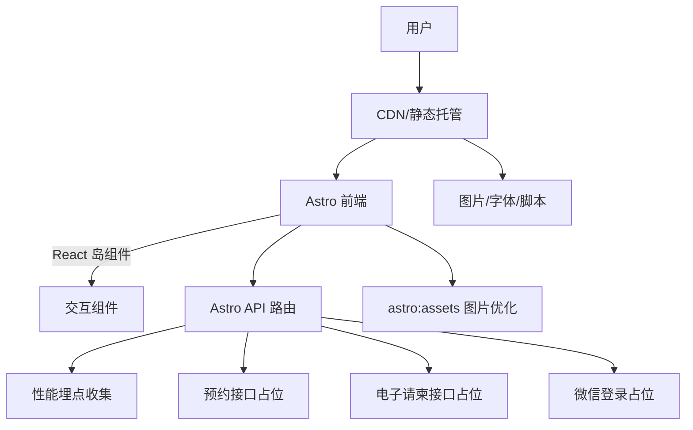

# 系统架构图

```mermaid
flowchart TD
  U[用户] --> B[CDN/静态托管]
  B --> A[Astro 前端]
  A -->|React 岛组件| C[交互组件]
  A --> D[Astro API 路由]
  D --> M[性能埋点收集]
  D --> R[预约接口占位]
  D --> I[电子请柬接口占位]
  D --> W[微信登录占位]
  A --> IMG[astro:assets 图片优化]
  B --> Static[图片/字体/脚本]
```

## 部署与资源
- 平台：Vercel/Netlify
- 资源：平台 CDN 与对象存储可选

